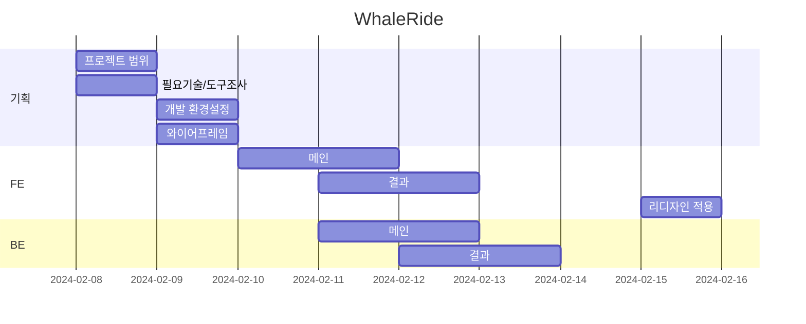
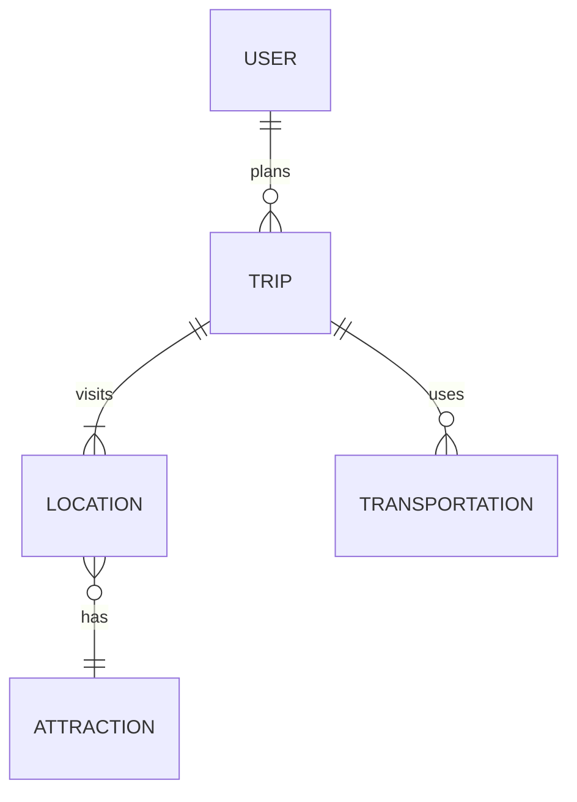
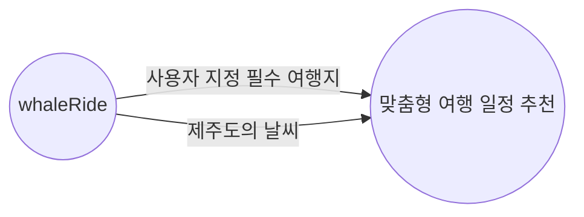

# 제주도를 바이크로 여행하는 모험가들을 위한 맞춤 여행일정 서비스

## 1. 목표와 기능

### 1.1 목표

- 사용자들이 제주도에서의 여행을 계획하고, 즐길 수 있도록 도와주는 서비스

### 1.2 기능

- **추천 여행 일정 수립 기능**: 사용자 지정 값 및 Chat GPT 추천 일정을 포함하여 여행 일정 수립

### 1.3 팀 구성

<table>
	<tr>
		<th>이은희</th>
	</tr>
 	<tr>
		<td></td>
	</tr>
</table>

## 2. 개발 환경 및 배포 URL
### 2.1 개발 환경
- HTML
- CSS Framework
- JavaScript
- 서비스 배포 환경
  - Github Pages

### 2.2 배포 URL
- https://eileen-2.github.io/whaleride.github.io/

### 2.3 URL 구조(모놀리식)
- main 

| 서비스이름  | URL                              | 기능설명   | HTML File Name | 비고|
| 메인       | '/'                              |홈페이지    | main.html      |     |
| 결과       | 'result                          | 결과페이지 | result.html    |     |   

## 3. 요구사항 명세와 기능 명세

 

## 4. 프로젝트 구조와 개발 일정
### 4.1 프로젝트 구조
- 프로젝트구조
  
📦WhaleRide  
 ┣ 📂main  
 ┃ ┣ 📂style   
 ┃ ┣ 📂img    
 ┗ 📜README.md

### 4.1 개발 일정(WBS)

## 5. 역할 분담

- 서비스 기획 및 개발: 이은희

## 6. 와이어프레임 / UI / BM

### 6.1 와이어프레임

### 6.2 화면 설계
 
<table>
    <tbody>
        <tr>
            <td>메인</td>
            <td>결과</td>
        </tr>
        <tr>
            <td></td>
            <td></td>
        </tr>
        </tr>
    </tbody>
</table>

## 7. 데이터베이스 모델링(ERD)

- USER 엔티티는 여러 TRIP을 계획할 수 있음.
- 각각의 TRIP은 여러 LOCATION을 방문하며, 여러 TRANSPORTATION을 사용할 수 있음.
- 각 LOCATION은 여러 ATTRACTION을 가지고 있음.

## 9. 메인 기능
- **맞춤형 여행 일정 및 경로 추천**: 사용자 지정 필수 여행지, 제주도의 날씨 등을 고려하여 맞춤형 여행 일정 및 경로를 추천

## 10. 에러와 에러 해결
1. **에러: SyntaxError** - 코드에 문법적 오류가 있을 때 발생 -> '코드의 품질(+효율성)'과 관련됨.
   - **해결 방법:** 문법 오류를 확인하고 올바르게 수정해야함.
     -> 예를 들어, 괄호, 따옴표, 콜론 등의 쌍이 맞지 않거나, 예약어를 잘못 사용한 경우.
    * 세심함

2. **에러: TypeError** - 잘못된 타입의 객체를 사용하려고 할 때 발생 -> '방향'과 '결과'와 관련됨.
   -> 예를 들어, 정의되지 않은 함수를 호출하거나, 숫자를 문자열로 처리하려고 할 때.
   - **해결 방법:** 해당 변수나 함수의 타입을 확인하고, 필요한 경우 타입 변환을 수행하거나, 적절한 타입의 값을 사용.
    * 확인하는 습관

4. **에러: ImportError** - 모듈 또는 패키지를 잘못 임포트하려고 할 때 발생
   - **해결 방법:** 임포트하려는 모듈이나 패키지의 이름을 확인하고, 필요한 경우 해당 모듈이나 패키지를 설치. 모듈의 경로가 올바른지 확인하고, 필요한 경우 PYTHONPATH 환경 변수를 수정.
    * 확인하는 습관 
    * 정확성

## 10. 개발하며 느낀점

1. **HTML, JS, CSS 각각을 명확히 파악한 점:** 이번 프로젝트를 진행하면서 HTML, JS, CSS가 각각 어떤 역할을 하는지, 그리고 이들이 어떻게 서로 연결되는지 명확하게 이해할 수 있었음. 이게 웹 개발에서 얼마나 중요한지 깨닫게 됐고, 이제 각 기술의 역할을 잘 이해하면 코드를 더 잘 짤 수 있을 것 같다는 생각이 들었음.

2. **다양한 분야와의 협업의 중요성:** 이번 프로젝트를 통해 하나의 프로젝트를 완성하는 것은 여러 기술 영역이 함께 협력하는 것임을 알게 됐음. 각자 전문가인 분야를 이해하고 존중하는 것이 얼마나 중요한지 느꼈음.

3. **도메인 지식과 의사소통의 중요성:** 주로 다루는 분야가 아니더라도, 다른 도메인의 기본적인 지식을 갖춰야 한다는 것을 깨달았음. 이런 이해를 바탕으로 다른 분야의 전문가들과 의사소통을 할 수 있었고, 서로의 작업을 이해하고 존중하는데 큰 도움이 됐음.
